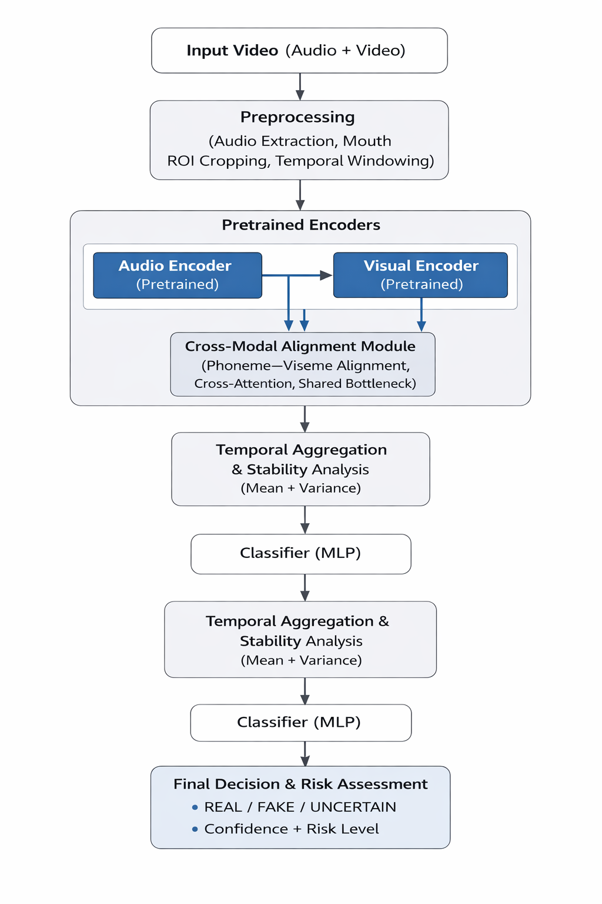
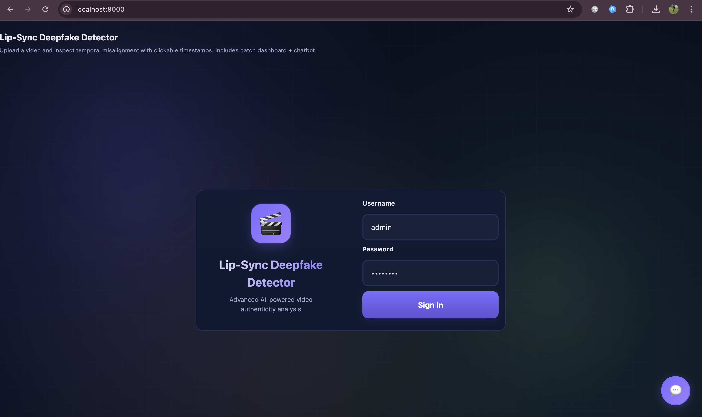
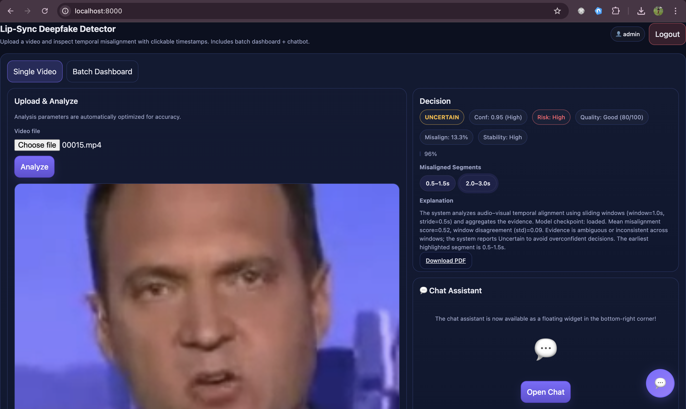
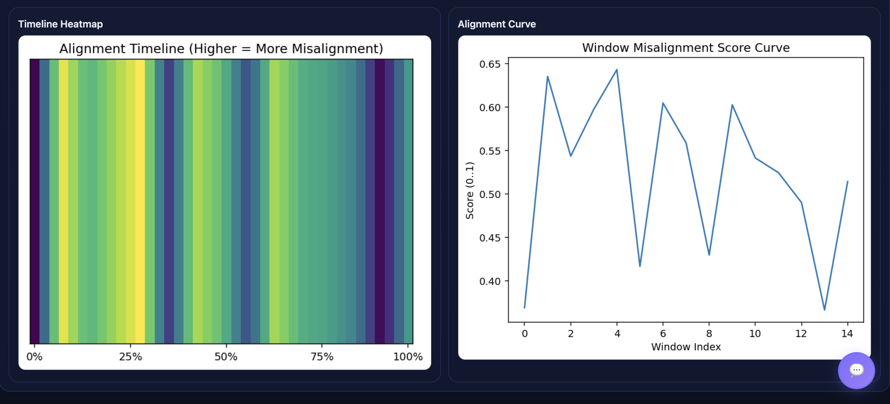
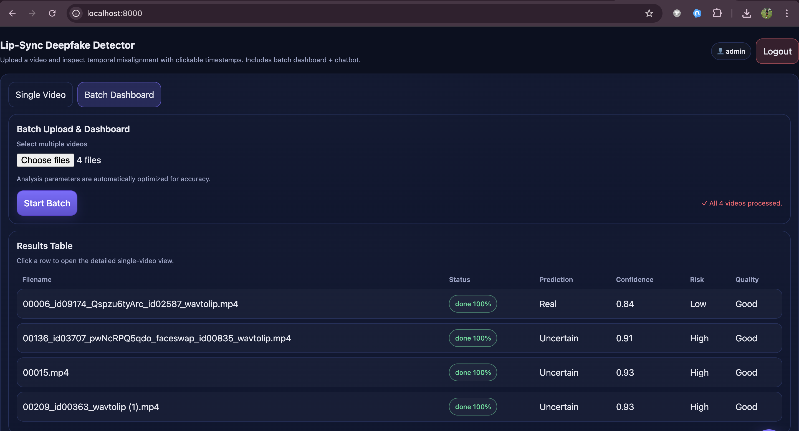
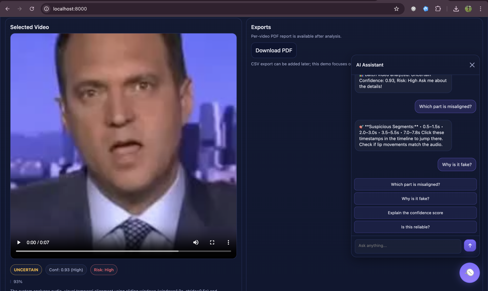

##  Lip-Sync Deepfake Detector
## Audio–Visual Temporal Inconsistency Modeling (Action Learning – DSA12)

An explainable AI system for detecting lip-sync deepfakes by modeling cross-modal temporal alignment between speech and lip motion.

Unlike traditional deepfake detection systems that rely on visual artifacts, this project analyzes:

Phoneme–viseme alignment

Audio–visual synchronization stability

Window-level temporal inconsistency

Alignment variance & uncertainty

## 🧠 Problem Motivation

Modern lip-sync deepfakes:

Preserve speaker identity

Modify only the mouth region

Appear realistic frame-by-frame

Contain minimal visible artifacts

However:

Natural human speech contains strong temporal coupling between phonemes (audio) and visemes (lip shapes).

Deepfake systems often fail to maintain consistent alignment over time.

This system detects those inconsistencies.

## 🏗 System Architecture


## Pipeline Overview

Input Video (Audio + Video)

Preprocessing

Audio extraction

Mouth ROI cropping

Temporal windowing

Pretrained Encoders

Audio encoder (speech-aware)

Visual encoder (lip-motion focused)

Cross-Modal Alignment Module

Phoneme–viseme alignment

Cross-attention

Shared bottleneck representation

Temporal Aggregation & Stability Analysis

Mean alignment score

Variance across windows

Classifier (MLP)

Final Decision & Risk Assessment

REAL / FAKE / UNCERTAIN

Confidence score

Risk level

## 🔍 Detection Logic
Window-Based Temporal Analysis

Instead of classifying the entire video:

The video is divided into overlapping windows

Each window is independently scored

Scores are aggregated for final prediction

This enables:

Robust detection

Temporal localization

Reduced false positives

Stability estimation

Responsible AI – UNCERTAIN Policy

## The system outputs:

REAL

FAKE

UNCERTAIN

UNCERTAIN is triggered when:

Scores are near the decision boundary

Windows strongly disagree

Evidence is ambiguous

This prevents over-confident false accusations.

## 🖥 Application Interface
## 🔐 Login Page


Secure authentication for controlled local deployment.

## 🎥 Single Video Analysis


## Displays:

REAL / FAKE / UNCERTAIN

Confidence score

Risk level

Misaligned time segments

Deterministic explanation

PDF export

## 📊 Alignment Visualizations


Includes:

Timeline heatmap

Window misalignment score curve

Temporal stability visualization

These features make the system interpretable rather than a black box.

## 📁 Batch Processing Dashboard


Supports:

Multi-video upload

Per-video independent inference

Progress tracking

Structured results table

Batch-level review

## 💬 Rule-Based Explanation Assistant


Deterministic explanation system grounded in model outputs.

Important:

Not a generative AI chatbot

No hallucinations

Responses derived directly from detection metrics

## 📊 Output Metrics

For each analyzed video, the system provides:

Prediction (REAL / FAKE / UNCERTAIN)

Confidence score (0–1)

Risk level (Low / Medium / High)

Misalignment ratio (%)

Stability indicator

Highlighted suspicious segments

PDF forensic report

## 📂 Project Structure

```text
ActionLearning-Lip-Syc-Deepfake-Detector/
│
├── app/                      # FastAPI backend
│   ├── main.py
│   ├── analysis.py
│   ├── model_runtime.py
│   ├── windowing.py
│   ├── quality_check.py
│   ├── heatmap.py
│   ├── report.py
│   ├── chatbot.py
│   ├── schemas.py
│   └── utils.py
│
├── web/                      # Frontend UI
│   └── index.html
│
├── LipSyncImages/            # README assets
│   ├── SystemArchitecture.png
│   ├── Login.png
│   ├── SinglePrediction.png
│   ├── Heatmap.png
│   ├── BatchPrediction.png
│   └── RulebasedChat.png
│
├── Dockerfile
├── docker-compose.yml
├── requirements.txt
├── run_server.py
└── README.md
```

## 🛠 Tech Stack
Backend

FastAPI

PyTorch

FFmpeg

NumPy

ReportLab

Frontend

HTML

CSS

JavaScript

Deployment

Docker

Hugging Face Spaces compatible

## 🚀 How to Run Locally
1️⃣ Install Dependencies
pip install -r requirements.txt
2️⃣ Start the Server
python run_server.py
3️⃣ Open in Browser
http://localhost:8000

Default login:

Username: admin
Password: admin123
## 🎓 Academic Context

Developed as part of:

EPITA – DSA12 (Action Learning)
Topic: Detecting Lip-Sync Deepfakes via Audio–Visual Temporal Inconsistency

Focus Areas:

Multimodal modeling

Temporal reasoning

Efficiency vs complexity trade-offs

Interpretability

Responsible AI

## 🔐 Responsible AI Commitment

This system:

Explicitly models uncertainty

Separates explanation from prediction

Does not override predictions based on quality score

Provides temporal localization

Avoids black-box-only decisions

## 🌱 Future Improvements

Fully trained large-scale audio–visual model

Cross-dataset generalization evaluation

Real-time inference optimization

GPU deployment

Enhanced phoneme–viseme interpretability maps

## 👤 Author

Bhavana Ramesh,
Ayush Chalise,
Vaishav Varma

Master’s in Data Science & Analytics
EPITA
